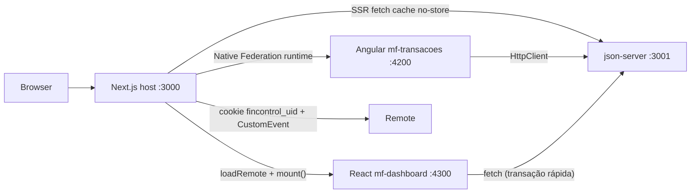
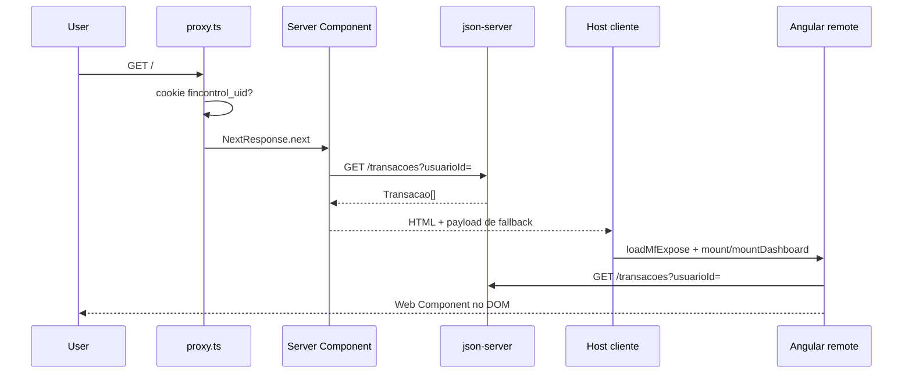
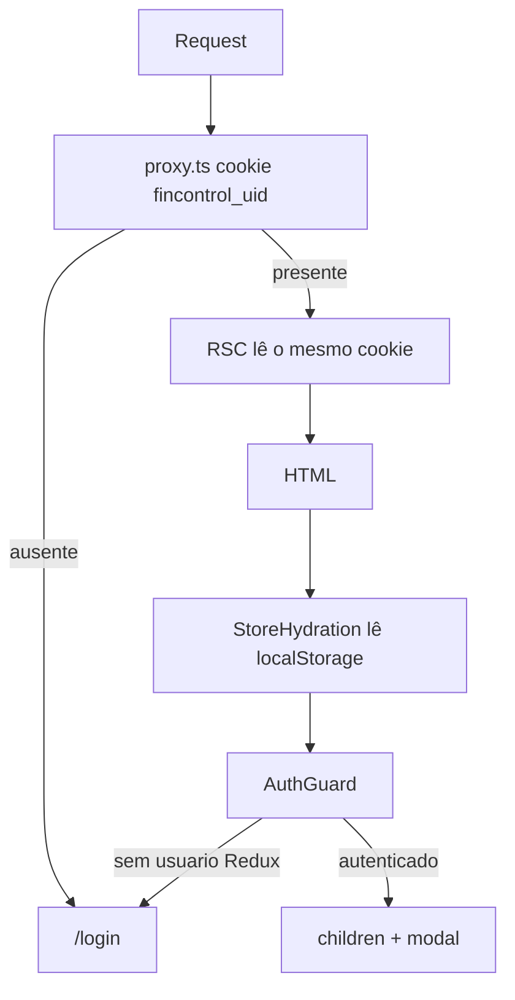
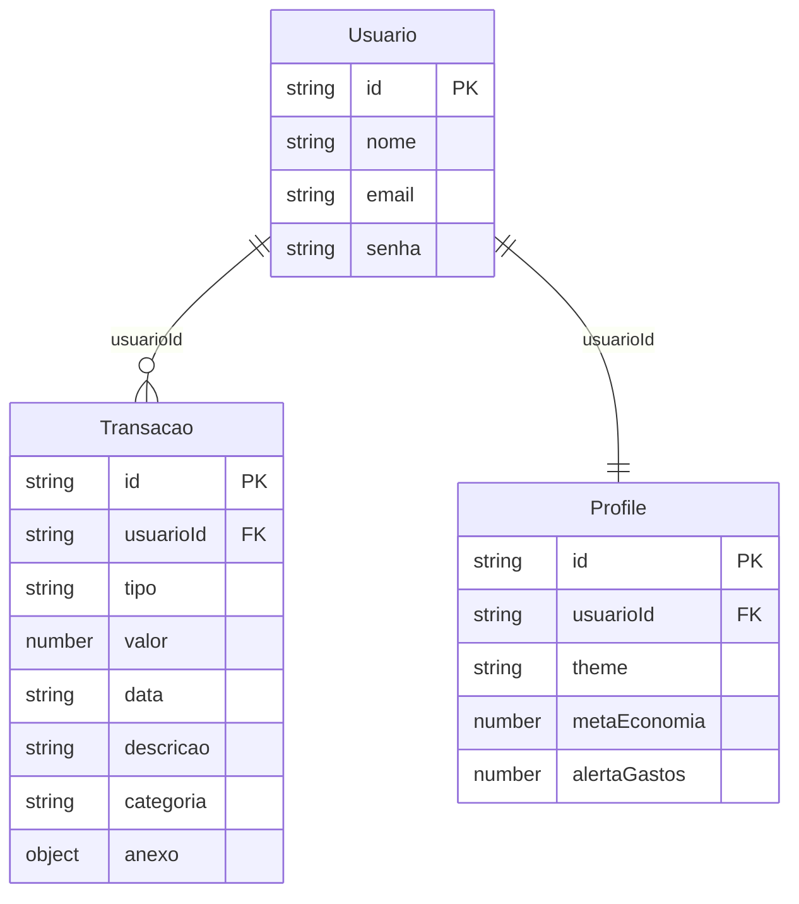
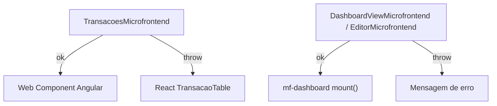

# Arquitetura do Fin Control

Documento técnico da arquitetura real do repositório. O Fin Control é o app de gerenciamento financeiro da POSTECH (Tech Challenge Fase 2). O **host** é Next.js 16 (App Router, React 19, TypeScript). A **listagem de transações** é um microfrontend Angular 19 via Native Federation. O **dashboard** (grid, widgets, gráficos, extrato recente, editor DnD) é um microfrontend React 19 em `:4300`, integrado ao host via `mount()` e com **modo standalone** para desenvolvimento isolado. Os dados vêm de um json-server sobre `db.json`.

Este texto descreve o código como está, não o desenho ideal. Limites acadêmicos (auth sem JWT, senhas em claro, persistência em arquivo) estão na [seção 10](#10-deploy-limites-e-dívida-técnica).

---

## 1. Visão geral e contexto

| Papel | Tecnologia | Porta (dev) |
|---|---|---|
| Host / shell | Next.js 16.2.7, React 19.2, TypeScript | `3000` |
| Remote de transações | Angular 19 + Native Federation + Angular Elements | `4200` |
| Remote do dashboard | React 19 + Vite (multi-entry) | `4300` |
| API mock | json-server 0.17 + `db.json` | `3001` |
| Estado do host | Redux Toolkit | — |
| Validação de formulários | Zod 4 + react-hook-form | — |
| Estilo | Tailwind CSS 4, CVA, tokens CSS compartilhados | — |
| Design system | Storybook 10 (`@storybook/nextjs-vite`) | `6006` |

`npm run dev` sobe api + remotes em paralelo; o **host Next só inicia** quando ambos `remoteEntry.json` respondem (`scripts/wait-for-remotes.mjs`, timeout 3 min):

```6:8:package.json
    "dev": "concurrently -n api,mf-tx,mf-dash,host \"npm run dev:api\" \"npm run dev:mf-transacoes\" \"npm run dev:mf-dashboard\" \"npm run dev:host\"",
    "dev:host": "node scripts/wait-for-remotes.mjs && npm run dev:next",
```

Não há Prisma, SQLite, Postgres, rotas `app/api/**` nem Server Actions (`"use server"`). O host e o remote falam **direto** com o json-server. Não existe BFF.

Variáveis públicas (embutidas no bundle no build):

| Variável | Padrão | Uso |
|---|---|---|
| `NEXT_PUBLIC_API_URL` | `http://localhost:3001` | Base REST do json-server |
| `NEXT_PUBLIC_MF_TRANSACOES_URL` | `http://localhost:4200` | Origem do `remoteEntry.json` do Angular |
| `NEXT_PUBLIC_MF_DASHBOARD_URL` | `http://localhost:4300` | Origem do `remoteEntry.json` do dashboard React |
| `VITE_API_URL` | `http://127.0.0.1:3001` | API usada pelo mf-dashboard em modo standalone |

---

## 2. Diagrama de alto nível



Fluxo resumido:

1. O browser pede uma rota ao Next.
2. `src/proxy.ts` (convenção Next.js 16 no lugar de `middleware.ts`) exige o cookie `fincontrol_uid`, exceto em `/login`.
3. Server Components leem o cookie, buscam transações na API e renderizam o shell (Header, Footer, slot de modal).
4. No cliente, wrappers `next/dynamic({ ssr: false })` tentam montar o remote Angular. Se `remoteEntry.json` falhar, o host cai no fallback React.
5. Mutações (criar/editar/excluir) disparam `fincontrol:transacoes-changed`. O host faz `router.refresh()`; o remote recarrega a lista.



---

## 3. Organização do repositório

```
financial-control/
├── src/                          # Host Next.js
│   ├── app/                      # App Router (páginas, layouts, @modal)
│   │   └── services/             # Clientes HTTP (transacoes, usuarios, profiles)
│   ├── components/               # UI do host + wrappers do microfrontend
│   │   └── ui/                   # Primitivos (Button, Card, Modal, Input…)
│   ├── data/                     # Tipos de domínio, seeds e funções puras
│   ├── lib/                      # Loader NF, sessão, anexos, temas, eventos
│   ├── store/                    # Redux Toolkit
│   └── proxy.ts                  # Gate de borda (Next.js 16)
├── mf-transacoes/                # Remote Angular 19 (listagem de transações)
├── mf-dashboard/                 # Remote React 19 (standalone SPA + federation exposes)
│   ├── index.html                # Entry do modo standalone (:4300/)
│   ├── src/standalone/           # Shell dev isolada (só visualização)
│   └── src/exposes/              # mount() para o host
├── shared/
│   ├── fincontrol-themes.css     # Tokens CSS usados pelos runtimes
│   ├── dashboard-contract.ts     # Tipos e eventos host ↔ mf-dashboard
│   └── dashboard-default-layout.ts # Layout padrão compartilhado
├── db.json                       # Persistência do json-server
├── json-server.json              # Porta 3001, watch
├── docker-compose.yml
├── Dockerfile                    # Host standalone
├── Dockerfile.api
└── .storybook/
```

Alias TypeScript do host: `@/*` → `./src/*` (`tsconfig.json`). O remote Angular é excluído do `tsconfig` do host.

Papéis das pastas do host:

| Pasta | Responsabilidade |
|---|---|
| `src/app` | Rotas, layouts, loading/error/not-found, slot paralelo `@modal` |
| `src/app/services` | `fetch` contra `NEXT_PUBLIC_API_URL`; usado em RSC e em client components |
| `src/data` | Contratos de domínio e regras sem I/O (`calcularSaldo`, `sugerirCategoria`, seeds) |
| `src/lib` | Integração (federation, cookie, anexos, tema) |
| `src/store` | Estado de sessão e preferências de dashboard |
| `src/components` | Composição de UI; não há pasta `features/` |

---

## 4. Host Next.js (App Router)

### 4.1 Root layout

[`src/app/layout.tsx`](src/app/layout.tsx) é Server Component, `export const dynamic = 'force-dynamic'` (nada é cacheado entre requests). Recebe dois slots: `children` e `modal` (rota paralela `@modal`).

Ordem de composição:

1. Font Inter (`next/font/google`).
2. Scripts `es-module-shims` com `strategy="beforeInteractive"` — necessários para o import map do Native Federation.
3. `StoreProvider` (Redux + hidratação de auth/profile).
4. `AuthGuard` (proteção client-side).
5. `{children}` + `{modal}`.
6. `data-fin-theme="teal"` no `<html>` como tema padrão até o profile hidratar.

### 4.2 Mapa de rotas

| Rota | Tipo | Função |
|---|---|---|
| `/` | RSC | Dashboard: busca transações, monta o remote `mountDashboard` |
| `/login` | Client | Formulário Zod; rota pública |
| `/transacoes` | RSC + layout | Listagem: remote `mount` |
| `/transacoes/nova` | Página cheia | Formulário React de criação |
| `/transacoes/[id]` | RSC | Detalhe |
| `/transacoes/[id]/editar` | Página cheia | Formulário React de edição |
| `/preview/[id]` | RSC | `redirect` para `/transacoes/[id]` |
| `@modal/(.)transacoes/nova` | Interceptação | Modal de criação |
| `@modal/(.)transacoes/[id]/editar` | Interceptação | Modal de edição |
| `@modal/(.)preview/[id]` | Interceptação | Modal de preview |
| `@modal/default.tsx` | Default | `null` quando não há modal |

Layout de `/transacoes` ([`src/app/transacoes/layout.tsx`](src/app/transacoes/layout.tsx)) injeta Header + `<main>` + Footer. A home (`/`) faz o mesmo inline. Convenções de App Router usadas em transações: `loading.tsx` (skeleton), `error.tsx` (boundary com retry), `not-found.tsx`.

### 4.3 Rotas paralelas e interceptação

Soft navigation (Link interno) para `/transacoes/nova`, `/transacoes/[id]/editar` ou `/preview/[id]` **não troca a página de fundo**. Next intercepta com o prefixo `(.)` e renderiza o slot `@modal` por cima.

O shell do overlay é [`src/components/ui/modal.tsx`](src/components/ui/modal.tsx): `<dialog>` nativo, `showModal()`, fechar chama `router.back()`.

- Preview modal é RSC: busca a transação no servidor e chama `notFound()` se falhar.
- Create/edit modais usam `TransacaoModalForm`, que no sucesso faz `router.back()` + `router.refresh()`.
- Hard navigation / refresh em `/preview/[id]` **não** abre modal: [`src/app/preview/[id]/page.tsx`](src/app/preview/[id]/page.tsx) redireciona para o detalhe.

O remote Angular **não** usa `/preview`. Ele dispara `fincontrol:navigate` para páginas cheias (`/transacoes/:id`, `/transacoes/:id/editar`).

### 4.4 RSC vs client

Páginas de listagem/dashboard são async Server Components: leem `cookies().get('fincontrol_uid')` e chamam `getTransacoesOrThrow`. A interatividade (forms, charts, MF, header, guard) vive em componentes `'use client'`. Os wrappers `DashboardListagem` e `TransacoesListagem` usam `next/dynamic` com `ssr: false` para o loader de federation não rodar no servidor.

`next.config.ts` só define `output: 'standalone'`. Não há plugin de Module Federation no bundler do Next.

### 4.5 Gate de borda (`proxy.ts`)

No Next.js 16, o arquivo `src/proxy.ts` substitui `middleware.ts`. Exporta `proxy(request)` e `config.matcher`.

```5:26:src/proxy.ts
export function proxy(request: NextRequest) {
  const { pathname } = request.nextUrl;
  const uid = request.cookies.get('fincontrol_uid')?.value;
  const isPublic = PUBLIC_PATHS.has(pathname);

  if (!uid && !isPublic) {
    const loginUrl = new URL('/login', request.url);
    loginUrl.searchParams.set('from', pathname);
    return NextResponse.redirect(loginUrl);
  }

  if (uid && pathname === '/login') {
    return NextResponse.redirect(new URL('/', request.url));
  }

  return NextResponse.next();
}
```

Matcher ignora `_next/static`, `_next/image`, `favicon.ico` e arquivos com extensão. Única rota pública: `/login`.

---

## 5. Autenticação

Não há JWT, NextAuth nem store de sessão no servidor. A identidade é um **user id em cookie** mais um **objeto público no localStorage**.

### 5.1 Login

1. [`src/app/login/page.tsx`](src/app/login/page.tsx) valida com Zod (`z.email()`, senha obrigatória).
2. `useAuth().login` despacha `loginThunk`.
3. [`autenticar`](src/app/services/usuarios.ts) faz `GET /usuarios` (todos os usuários) e compara email/senha **no cliente** (`validarCredenciais`).
4. Sucesso: `persistUsuario` grava `localStorage['fincontrol:auth']` (`UsuarioPublico`, sem senha) e cookie `fincontrol_uid` (7 dias, `path=/`, `SameSite=Lax`, `Secure` só em HTTPS).
5. `router.replace('/')`. Cadastro (`CriarUsuarioModal`) faz `POST /usuarios`, `POST /profiles` com profile padrão e auto-login.

### 5.2 Duas camadas de proteção



| Camada | Arquivo | Critério |
|---|---|---|
| Borda | `src/proxy.ts` | Presença do cookie |
| Cliente | `src/components/auth-guard.tsx` | `state.auth.usuario !== null` após hidratar |

O guard mostra “Carregando...” enquanto `loading === true` (antes do `hydrateFromStorage`). Logout (`header`) chama `clearPersistedUsuario` e redireciona para `/login`.

### 5.3 Escopo nos Server Components

RSC **não revalida senha**. Só usa o cookie para filtrar `?usuarioId=`. Quem definir `fincontrol_uid=1` no browser recebe as transações do usuário `1` no HTML. Adequado ao mock acadêmico; insuficiente para produção.

### 5.4 Quirk de seed vs API

| Fonte | Email do usuário `1` |
|---|---|
| `db.json` (API no ar) | `pedro.missaglia@gmail.com` |
| `seedUsuarios` (API fora) | `pedromissaglia@gmail.com` |

O README cita o e-mail sem ponto. Com json-server rodando, o login válido é o de `db.json`.

---

## 6. Camada de dados e domínio

### 6.1 Persistência

json-server lê/escreve [`db.json`](db.json). Config em [`json-server.json`](json-server.json): porta `3001`, `watch: true`. Três coleções REST: `usuarios`, `transacoes`, `profiles`.

### 6.2 Modelo



`Profile.id` é igual a `usuarioId` (1:1). Widgets do dashboard ficam em `profile.widgets[]`.

**Transacao** ([`src/data/transacoes.ts`](src/data/transacoes.ts)):

- `tipo`: `deposito` \| `transferencia` \| `saque` \| `pagamento`
- `categoria`: `salario`, `freelance`, `moradia`, `alimentacao`, `transporte`, `saude`, `educacao`, `lazer`, `servicos`, `transferencias`, `outros`
- `anexo` opcional: `{ nome, mimeType, dataUrl }`
- **Única entrada no saldo:** `tipo === 'deposito'` (`isEntrada`)

Regras puras no mesmo módulo: `calcularSaldo`, `sugerirCategoria` (regex na descrição), `normalizarTransacao` (categoria default `outros`), ordenação e filtros. Analytics em [`src/data/analises.ts`](src/data/analises.ts): evolução de saldo, totais por tipo/categoria, resumo receitas/despesas.

O remote Angular **duplica** tipos e helpers em `mf-transacoes/src/app/models.ts`, `analises.ts` e `profile.ts` — não há pacote compartilhado de TypeScript, só CSS de tema.

### 6.3 Serviços HTTP do host

[`src/app/services/transacoes.ts`](src/app/services/transacoes.ts), [`usuarios.ts`](src/app/services/usuarios.ts), [`profiles.ts`](src/app/services/profiles.ts).

Contrato interno:

```ts
interface ApiResponse<T> {
  success: boolean;
  data?: T;
  message?: string;
}
```

Todas as leituras usam `cache: 'no-store'`.

| Método | Endpoint | Comportamento |
|---|---|---|
| GET | `/transacoes?usuarioId=` | Lista; se a API falhar, devolve `seedTransacoes` do usuário |
| GET | `/transacoes/:id` | Detalhe; fallback para seed |
| POST | `/transacoes` | Cria; dispara `notifyTransacoesChanged()` |
| PUT | `/transacoes/:id` | Atualiza; dispara o mesmo evento |
| DELETE | `/transacoes/:id` | Apaga; dispara o mesmo evento |
| GET | `/usuarios` | Login/cadastro; fallback `seedUsuarios` |
| POST | `/usuarios` | Cadastro; rejeita e-mail duplicado no cliente |
| GET/PUT/POST | `/profiles/:id` | Preferências; save engole erro (`console.error`) |

`getTransacoesOrThrow` / `getTransacaoOrThrow` são a variante estrita usada pelas páginas RSC (estouram para `error.tsx` / `notFound()`).

O Angular usa o mesmo REST via `HttpClient` ([`mf-transacoes/src/app/transacoes.service.ts`](mf-transacoes/src/app/transacoes.service.ts)): `listar`, `criar`, `excluir`.

### 6.4 Validação

Só no formulário (Zod + `@hookform/resolvers`). A API json-server **não valida** schema.

| Formulário | Arquivo | Regras principais |
|---|---|---|
| Login | `src/app/login/page.tsx` | e-mail válido, senha não vazia |
| Cadastro | `src/components/criar-usuario-modal.tsx` | nome ≥ 2, e-mail, senha ≥ 6 |
| Transação | `src/components/transacao-form.tsx` | tipo enum, valor > 0, data ≤ hoje, descrição 2–80, categoria enum |
| Transação rápida | `src/components/nova-transacao-rapida.tsx` | tipo enum, valor > 0 |

Anexos ([`src/lib/anexo.ts`](src/lib/anexo.ts)): JPEG/PNG/WebP/PDF, máximo 2 MB, persistidos como data URL no JSON (não há object storage).

---

## 7. Estado no host (Redux Toolkit)

[`src/store/index.ts`](src/store/index.ts) registra três slices. [`src/store/provider.tsx`](src/store/provider.tsx) hidrata no `useEffect` do mount: relê localStorage, reforça o cookie, `hydrateFromStorage`, e se houver usuário dispara `loadDashboardProfile`.

| Slice | Estado | Persistência |
|---|---|---|
| `auth` | `usuario`, `loading` | localStorage + cookie |
| `dashboard` | `theme`, `widgets`, `metaEconomia`, `alertaGastos` | `PUT/POST /profiles` |
| `transacoes` | `version: number` | Nenhuma — só invalida UI após mutate |

`dashboard` aplica tema via `document.documentElement.dataset.finTheme` e dispara `fincontrol:theme-changed` para o remote. Widgets: ids `saldo`, `graficos`, `extrato`, `rapida`, `meta`, `alerta`; cada um tem `visible` e `cols` (1 \| 2); ordem via `moveWidget`. Profile inclui também `transacoesPageSize`, `transacoesFiltros` e `extratoLimite`.

O remote **não lê Redux**. Recebe `apiUrl` + `usuarioId` e busca profile/transações sozinho. Os dois lados podem divergir até o próximo evento/refresh.

---

## 8. Microfrontend (Native Federation)

### 8.1 Por que não é Webpack Federation no Next

[`next.config.ts`](next.config.ts) não configura remotes. O caminho ativo é:

1. Angular gera `remoteEntry.json` com `@angular-architects/native-federation`.
2. O browser carrega `es-module-shims` (shim mode).
3. [`src/lib/load-mf-remote.ts`](src/lib/load-mf-remote.ts) monta um import map e importa o expose.

### 8.2 Exposes do remote

[`mf-transacoes/federation.config.js`](mf-transacoes/federation.config.js):

```js
exposes: {
  './Transacoes': './src/app/bootstrap-mf.ts',
}
```

Bootstrap listagem ([`mf-transacoes/src/app/bootstrap-mf.ts`](mf-transacoes/src/app/bootstrap-mf.ts)) usa [`mf-app.ts`](mf-transacoes/src/app/mf-app.ts):

1. `createApplication({ providers: MF_PROVIDERS })` — HttpClient, animações, **zoneless** change detection.
2. `createCustomElement` registra `mf-transacoes-list`.
3. Injeta o custom element no container do host; `unmount` limpa o container (singleton Angular preservado).

Contrato de props (listagem):

```ts
interface TransacoesMfProps {
  apiUrl: string;
  usuarioId?: string;
  filtros: TransacoesFiltros;
  pageSize: number;
}
```

**mf-dashboard (React)** — dual-bootstrap (padrão React MFE):

| Modo | Entry | URL |
|---|---|---|
| Standalone | [`index.html`](mf-dashboard/index.html) → [`src/standalone/main.tsx`](mf-dashboard/src/standalone/main.tsx) | `http://127.0.0.1:4300/` |
| Federado | [`src/exposes/dashboard-view.tsx`](mf-dashboard/src/exposes/dashboard-view.tsx) / [`dashboard-editor.tsx`](mf-dashboard/src/exposes/dashboard-editor.tsx) exportam `mount()` | `remoteEntry.json` + `DashboardView.js` |

Build dual ([`scripts/build-all.mjs`](mf-dashboard/scripts/build-all.mjs)): SPA standalone → `dist/index.html`; depois [`build:exposes`](mf-dashboard/scripts/build-exposes.mjs) (lista centralizada em [`exposes-config.mjs`](mf-dashboard/scripts/exposes-config.mjs)). Dev ([`scripts/dev-server.mjs`](mf-dashboard/scripts/dev-server.mjs)): `vite dev` no standalone com HMR; middleware serve os assets federados de `dist/`; watch rebuild só dos exposes.

Exposes:

```ts
// remoteEntry.json
{ "./DashboardView": "DashboardView.js", "./DashboardEditor": "DashboardEditor.js" }
```

### 8.3 Loader no host

`loadRemote(baseUrl, exposeKey)` (generalizado):

1. Injeta `{baseUrl}/styles.css` com `data-mf-styles={baseUrl}` (erro de CSS não derruba o mount).
2. `GET {baseUrl}/remoteEntry.json`.
3. Mapeia `shared[]` no import map (`packageName` → URL absoluta do chunk), quando houver.
4. `importShim(moduleUrl)` do expose.
5. Resolve `mount` (named export ou `default`).

Aliases: `loadMfExpose` → transações (`MF_TRANSACOES_URL`), `loadDashboardExpose` → dashboard (`MF_DASHBOARD_URL`). Em Docker/produção os nginx dos remotes enviam `Access-Control-Allow-Origin *`.

### 8.4 Degradação



[`TransacoesMicrofrontend`](src/components/transacoes-microfrontend.tsx) mantém `mode: loading | remote | fallback` com fallback React (`TransacaoTable`). [`DashboardViewMicrofrontend`](src/components/dashboard-view-microfrontend.tsx) e [`DashboardEditorMicrofrontend`](src/components/dashboard-editor-microfrontend.tsx) usam `loading | remote | error` — **sem fallback de UI duplicada** no host; se `:4300` estiver offline, exibem mensagem apontando para `MF_DASHBOARD_URL`. Redux permanece fonte da verdade; o editor emite `fincontrol:dashboard-layout-changed` (e eventos granulares de toggle/cols).

### 8.5 Contrato de eventos

Definido em [`src/lib/mf-events.ts`](src/lib/mf-events.ts) e espelhado no Angular com strings literais.

| Evento | Direção | Efeito |
|---|---|---|
| `fincontrol:navigate` | remote → host | `detail.href` → `router.push` (páginas cheias) |
| `fincontrol:transacoes-changed` | host → remote (e host) | remote recarrega lista; host `router.refresh()` |
| `fincontrol:theme-changed` | host ↔ remote | sincroniza `data-fin-theme` |
| `fincontrol:dashboard-layout-changed` | mf-dashboard → host | `setDashboardLayout` + persist profile |
| `fincontrol:dashboard-widget-toggle` | mf-dashboard → host | `toggleWidget` |
| `fincontrol:dashboard-widget-cols` | mf-dashboard → host | `setWidgetCols` |

Cookie `fincontrol_uid` é lido no host (`getUsuarioIdFromCookie`) e passado como prop; o remote também pode persistir tema/profile pela API.

### 8.6 Capacidades do remote

**Listagem** (`TransacoesListComponent`): busca, filtro por tipo/categoria/período/valor, paginação configurável, exclusão com confirmação, navegação para detalhe/edição. Material Design.

**Dashboard (mf-dashboard React)**: expõe `./DashboardView` (home) e `./DashboardEditor` (profile — seção layout). Grid, previews, DnD e **extrato recente** (React) vivem no MFE. Em **modo standalone** (`http://127.0.0.1:4300/`), o dev server Vite serve `index.html` com a visualização do dashboard e layout padrão. Em **modo federado**, o host monta os exposes via `loadRemote()`; metas, alertas e persistência de layout continuam no Redux/profile do host.

---

## 9. UI, design system e DX

### 9.1 Host

Primitivos em [`src/components/ui`](src/components/ui): Button, Card, Input, Label, Select, Badge, CurrencyInput, Modal. Variantes com `class-variance-authority`; classes mescladas com `cn()` (`clsx` + `tailwind-merge`).

Tailwind v4 entra por `@import 'tailwindcss'` em [`src/app/globals.css`](src/app/globals.css). Cores do `@theme inline` apontam para CSS variables HSL.

### 9.2 Temas compartilhados

[`shared/fincontrol-themes.css`](shared/fincontrol-themes.css) é importado pelo host **e** por [`mf-transacoes/src/styles.css`](mf-transacoes/src/styles.css). Seletor `[data-fin-theme='…']` no `<html>`.

Temas ([`src/data/app-themes.ts`](src/data/app-themes.ts)): `teal` (default), `blue`, `emerald`, `slate`, `amber`, `dark`.

### 9.3 Storybook e testes

[`.storybook/main.ts`](.storybook/main.ts): framework `@storybook/nextjs-vite`, addons a11y/docs/vitest/chromatic. Stories colocalizadas (`button.stories.tsx`, `transacao-card.stories.tsx`) e demos em `src/stories/`. `npm run storybook` na porta 6006.

Não há suíte de testes unitários no host: não existem `vitest.config.*` nem arquivos `*.test.*` / `*.spec.*` em `src/`. Vitest e Playwright entram só via addon do Storybook (QA visual/a11y). Lint: [`eslint.config.mjs`](eslint.config.mjs) (Next core-web-vitals + import sort + Storybook). Format: Prettier + plugin Tailwind.

No remote, `ng test` (Karma/Jasmine) existe no `package.json`, mas os schematics usam `skipTests: true` — não há specs gerados.

### 9.4 Dependências residuais

- `ollama` está no `package.json` do host e **não é importado** em `src/`.
- No Angular, o runtime do Softarc entra via `@angular-architects/native-federation` no build, não via import no host.

---

## 10. Deploy, limites e dívida técnica

### 10.1 Docker Compose

[`docker-compose.yml`](docker-compose.yml) sobe API, remotes e host:

| Serviço | Imagem | Porta host | Papel |
|---|---|---|---|
| `api` | [`Dockerfile.api`](Dockerfile.api) | `3001` | json-server; volume `./db.json` |
| `mf-transacoes` | [`mf-transacoes/Dockerfile`](mf-transacoes/Dockerfile) | `4200` → 80 | nginx servindo o remote Angular |
| `mf-dashboard` | [`mf-dashboard/Dockerfile`](mf-dashboard/Dockerfile) | `4300` → 80 | nginx servindo o remote React |
| `web` | [`Dockerfile`](Dockerfile) | `3000` | Next `output: 'standalone'` |

O host recebe `NEXT_PUBLIC_*` como **build args** (valores entram no bundle). Em cloud: Vercel para o host, static hosting + CORS para o remote, json-server ou API FIAP no `NEXT_PUBLIC_API_URL`.

### 10.2 Limites conscientes (escopo acadêmico)

1. **Auth:** senhas em texto em `db.json`; login baixa todos os usuários; cookie forjável; sem CSRF token além de SameSite=Lax.
2. **Sem BFF:** o browser fala com a API; CORS do json-server precisa permitir o origin do host e do remote.
3. **Validação só no cliente.**
4. **Anexos em data URL** incham `db.json` e não escalam.
5. **Duplicação de domínio** entre `src/data` e `mf-transacoes/src/app`.
6. **Seeds divergentes** (e-mail do usuário 1).
7. **Fallback de leitura mascara API caída** — o usuário pode ver dados seed sem perceber que a persistência falhou.
8. **Profile save silencioso** — falha de PUT/POST não chega na UI.
9. **Remote é client-only** — SEO/SSR do dashboard/listagem não inclui o Angular; o HTML inicial traz só o fallback potencial.
10. **`NEXT_PUBLIC_*` no build** — trocar URL de API/MF em runtime Docker exige rebuild do host.
11. **Sem testes automatizados de aplicação** — a superfície de QA é Storybook (host) e um `ng test` sem specs (remote).

### 10.3 Fronteira host vs remote (resumo)

| Responsabilidade | Onde vive |
|---|---|
| Login, cadastro, cookie, AuthGuard | Host React |
| Formulários create/edit (página e modal) | Host React |
| Preview interceptado | Host React (RSC + `@modal`) |
| Dashboard personalizável | Remote React (`mf-dashboard`), erro se offline |
| Listagem com filtros/paginação/exclusão | Remote Angular, fallback React (`TransacaoTable`) |
| Persistência REST | json-server |
| Tokens visuais | `shared/fincontrol-themes.css` |

Quando a API da FIAP substituir o json-server, o ponto de troca é `NEXT_PUBLIC_API_URL`, desde que o contrato REST (`/transacoes`, `/usuarios`, `/profiles`) se mantenha.
